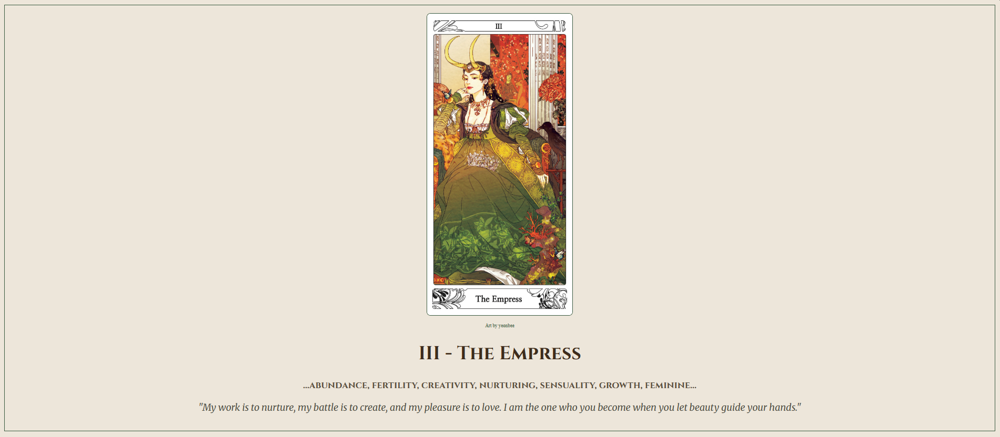

# 🌿 The Empress - Tarot Card Page

This is a simple HTML and CSS project that showcases **The Empress** card from the Major Arcana of the Tarot.

> "My work is to nurture, my battle is to create, and my pleasure is to love. I am the one who you become when you let beauty guide your hands."

## 🃏 About the Project

The page displays:
- A high-quality tarot card illustration of *The Empress* made by the korean artist yeonbee
- Keywords associated with the card: **abundance, fertility, creativity, nurturing, sensuality, growth, feminine**
- A poetic interpretation of her voice and purpose

The design is minimalist and centered, allowing the card and its meaning to speak for themselves.

## 💡 Technologies Used

- **HTML5**
- **CSS3**

This project is meant for practice and learning, where I wanted to apply <strong>storytelling</strong> and symbolism so that I wouldn't make a landing page that was too generic.

## 📸 Screenshot

## 🎨 Art Credit

Card artwork by **yeonbee** (used for educational and illustrative purposes).
